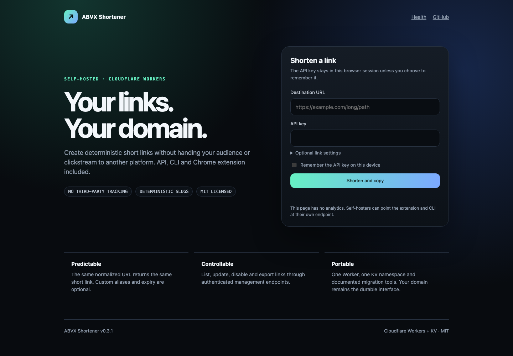

# ABVX Shortener

Self-hosted short links on your own domain, powered by Cloudflare Workers and KV.

[](https://github.com/markoblogo/abvx-shortener/actions/workflows/ci.yml)
[](https://github.com/markoblogo/abvx-shortener/releases)
[](LICENSE)

**[Live service](https://go.abvx.xyz)** · **[API reference](docs/api.md)** · **[Русская документация](README.ru.md)**



ABVX Shortener gives individuals and small teams a compact link service without a third-party redirect platform:

- deterministic slugs: the same normalized URL returns the same short link;
- custom aliases, expiration, fallback destinations and `301`/`302` redirects;
- authenticated link management, export, audit events and first-party counters;
- a browser interface, command-line client and Chrome Manifest V3 extension;
- no third-party analytics, advertising scripts or external UI dependencies.

## Quick start

Prerequisites: Node.js 22+ and a Cloudflare account with a domain managed by Cloudflare.

```bash
git clone https://github.com/markoblogo/abvx-shortener.git
cd abvx-shortener/worker
npm ci
npx wrangler login
npx wrangler kv namespace create LINKS
```

Copy the returned namespace ID into `worker/wrangler.toml`, replacing the existing `LINKS` ID. Then create an API key and deploy:

```bash
npx wrangler secret put API_KEY
npm run deploy
```

Attach a custom domain in **Cloudflare Dashboard → Workers & Pages → your Worker → Settings → Domains & Routes** and set `BASE_URL` in `wrangler.toml` to that HTTPS origin.

Verify the deployment:

```bash
curl --fail https://go.example.com/health
```

Expected shape:

```json
{"ok":true,"version":"0.4.0","requestId":"…"}
```

## Create a link

Use the web form or call the API directly:

```bash
curl --fail-with-body https://go.example.com/api/shorten \
  --request POST \
  --header 'content-type: application/json' \
  --header 'X-API-Key: YOUR_KEY' \
  --data '{"url":"https://example.com/long/path","customSlug":"demo"}'
```

The response includes the slug and ready-to-share URL:

```json
{
  "slug": "demo",
  "shortUrl": "https://go.example.com/demo",
  "created": true,
  "requestId": "…"
}
```

## Clients

### CLI

The repository includes a dependency-free Node.js client:

```bash
export ABVX_ENDPOINT=https://go.example.com
export ABVX_API_KEY=YOUR_KEY
./bin/abvx-shorten shorten https://example.com/article --custom-slug article
./bin/abvx-shorten list --limit 20
./bin/abvx-shorten stats --window hour
```

When using `API_KEYS_JSON`, also set `ABVX_API_KEY_ID` or pass `--api-key-id`.

### Chrome extension

1. Download `abvx-shortener-extension-v0.4.0.zip` from the release and unpack it.
2. Open `chrome://extensions`, enable **Developer mode**, and select **Load unpacked**.
3. Choose the unpacked `extension` directory and enter your endpoint and API key.

The extension requests permanent host access only for `go.abvx.xyz`. A custom endpoint triggers Chrome's optional permission prompt.

## Security model

- API operations require `API_KEY`, the dedicated Git Tweet writer key, or a role-based entry in `API_KEYS_JSON`.
- Browser requests are same-origin by default; additional origins must appear in `ALLOWED_ORIGINS`.
- Non-browser clients are enabled by default with `ALLOW_NO_ORIGIN=true`.
- Target and fallback URLs accept only public HTTP(S) destinations.
- Native Cloudflare rate limiting protects link creation in production.
- API key collections belong in a Wrangler secret, never in `wrangler.toml`.

Create a SHA-256 entry for role-based key rotation:

```bash
node -e "crypto.subtle.digest('SHA-256',new TextEncoder().encode(process.argv[1])).then(b=>console.log('sha256:'+Buffer.from(b).toString('hex')))" 'YOUR_KEY'
npx wrangler secret put API_KEYS_JSON
```

`API_KEYS_JSON` accepts entries such as:

```json
[{"id":"writer-1","role":"writer","secret_hash":"sha256:…"}]
```

Malformed key configuration fails closed. See [Security Policy](SECURITY.md) and [Configuration](docs/configuration.md).

## API and operations

| Area | Endpoints |
|---|---|
| Core | `GET /health`, `POST /api/shorten`, `GET /:slug` |
| Link management | `GET/PUT/DELETE /api/link/:slug`, `GET /api/links` |
| Bulk and export | `POST /api/links/bulk`, `GET /api/links/export` |
| Operations | `GET /api/stats`, `GET /api/events` |

Use [docs/api.md](docs/api.md) for examples and [openapi.yaml](openapi.yaml) for tooling. Operational counters are first-party and stored in your KV namespace; they are approximate under concurrent traffic.

## Project layout

```text
worker/       Cloudflare Worker, tests and deployment config
extension/    Chrome Manifest V3 extension
bin/          dependency-free CLI
docs/         API, architecture, configuration and operations
```

## Development

```bash
cd worker
npm ci
npm run check
npx wrangler dev
```

The test suite includes Cloudflare's Vitest runtime integration with a real local KV binding. CI also validates the extension, audits dependencies and performs a deployment dry run.

## Documentation

- [Architecture](docs/architecture.md)
- [API reference](docs/api.md)
- [Configuration](docs/configuration.md)
- [Operations and upgrades](docs/ops.md)
- [KV migration](docs/migration.md)
- [Git Tweet integration](docs/integrations.md)
- [Contributing](CONTRIBUTING.md)

## License

MIT © ABVX

<!-- ABVX:ECOSYSTEM:BEGIN -->
## ABVX ecosystem

- [AGENTS.md_generator](https://agentsmd.abvx.xyz/) — Keeps repository guidance and machine-readable context current. Current release: `v0.5.1`.
- [abvx-agent-skills](https://abvx.xyz/work/abvx-agent-skills) — Uses shared, reviewable agent capabilities during maintenance. Current release: `v0.15.0`.

_This block is generated from the reviewed ABVX ecosystem registry._
<!-- ABVX:ECOSYSTEM:END -->
