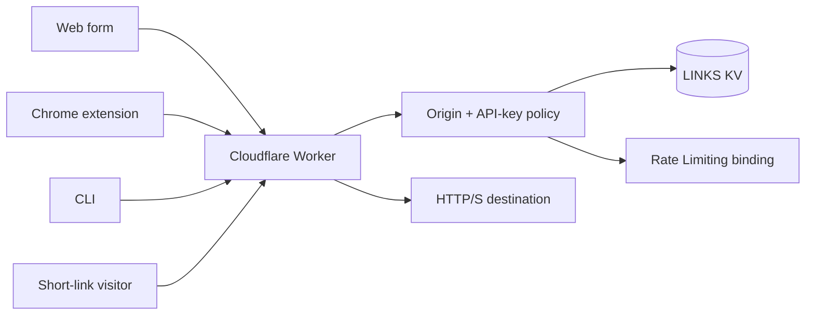

# Architecture

ABVX Shortener is one Cloudflare Worker with a KV namespace, a native rate-limiting binding, and three clients.

## Runtime boundaries

- `worker/src/index.ts` owns routing and HTTP behavior.
- `worker/src/auth/` authenticates keys, roles and browser origins.
- `worker/src/validation/` canonicalizes and validates target URLs.
- `worker/src/storage/` owns link records, audit events and approximate counters.
- `extension/` and `bin/` are untrusted API clients; they never receive KV access.

## Storage model

Normal KV keys are slugs. System data uses reserved prefixes:

- `stats:` for operational counters;
- `evt:` for expiring audit events;
- `rl:` for the local fallback limiter used when the native binding is absent.

Redirect lookups use KV's globally distributed read path. Link creation and management are authenticated. Redirect-hit bookkeeping runs through `ctx.waitUntil()` so it does not delay the response.

KV counters are intentionally approximate because read-modify-write operations are not atomic. They support personal operational visibility, not billing or compliance accounting. A future high-volume deployment should move event analytics to Analytics Engine or an indexed store.

## Security invariants

- API secrets are Wrangler secrets and never committed configuration values.
- Browser origins are same-origin or explicitly allowed.
- Non-browser clients can be enabled independently.
- All target and fallback destinations must be public HTTP(S) URLs.
- Writer keys can modify only links they created; admin keys can manage all links.
- Token-bound private links are available to their creator and admins.
